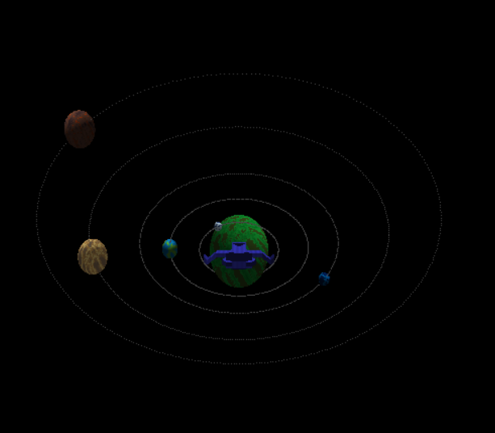

# Graphics-Space-Travel: Simulador del Sistema Solar
Una simulación interactiva 3D del sistema solar construida en Rust con implementación de renderizado por software.

Este proyecto implementa una visualización del sistema solar con shaders personalizados, renderizado de planetas y controles interactivos de cámara. Cuenta con un pipeline de renderizado basado en software con soporte para modelos 3D, iluminación, texturizado y varios efectos visuales.

## Características
- **Sistema Solar Interactivo**
  - Múltiples planetas con características y shaders únicos
  - Visualización de órbitas planetarias
  - Rotaciones y órbitas planetarias realistas
  - Generación de terreno específico para cada planeta usando algoritmos de ruido

- **Sistema de Sombreado Personalizado**
  - Shaders únicos para diferentes tipos de planetas:
    - Planetas tipo Tierra tropical
    - Mundos helados
    - Planetas desérticos
    - Mundos oceánicos
    - Planetas selváticos
    - Mundos volcánicos
    - Planetas primordiales antiguos

- **Características Avanzadas de Renderizado**
  - Pipeline de renderizado 3D por software
  - Proyección en perspectiva
  - Buffer de profundidad
  - Mapeo de normales
  - Efectos atmosféricos
  - Efectos de bloom para objetos luminosos
  - Post-procesamiento con desenfoque gaussiano

- **Controles Interactivos**
  - Teclas WASD para movimiento
  - Control con ratón para orientación de cámara
  - Rueda del ratón para zoom
  - Teclas 1-5 para teletransportarse a diferentes planetas
  - Tecla 'B' para vista aérea
  - ESC para salir

## Detalles Técnicos

### Componentes Principales
- **Sistema de Cámara**: Implementa una cámara orbital con movimiento suave y detección de colisiones
- **Fragment Shader**: Maneja el renderizado por píxel con soporte para varios efectos visuales
- **Vertex Shader**: Gestiona transformaciones 3D y cálculos de iluminación
- **Framebuffer**: Implementación personalizada para renderizado por software
- **Carga de OBJ**: Soporte para cargar modelos 3D en formato OBJ

### Generación de Planetas
Cada planeta utiliza diferentes configuraciones de ruido y parámetros para generar características superficiales únicas:
- Algoritmos de ruido personalizados para generación de terreno
- Múltiples capas de ruido para detalles superficiales complejos
- Esquemas de color variables para diferentes tipos de planetas
- Efectos atmosféricos y ambientales dinámicos

## Estructura del Proyecto
```
src/
├── main.rs          # Punto de entrada y bucle principal
├── camera.rs        # Implementación del sistema de cámara
├── color.rs         # Manejo y operaciones de color
├── fragment.rs      # Implementación del fragment shader
├── framebuffer.rs   # Buffer de renderizado por software
├── obj.rs           # Carga de modelos 3D
├── shaders.rs       # Implementación de shaders planetarios
├── solar_system.rs  # Lógica de simulación del sistema solar
├── triangle.rs      # Rasterización de triángulos
└── vertex.rs        # Estructura de datos de vértices y operaciones
```

## Dependencias
```toml
[dependencies]
nalgebra-glm = "0.18.0"  # Álgebra lineal y matemáticas gráficas
minifb = "0.24.0"        # Creación de ventanas y manejo de input
tobj = "4.0.0"           # Carga de archivos OBJ
fastnoise-lite = "1.0.1" # Generación de ruido para superficies planetarias
```

## Configuración y Ejecución
1. Asegúrate de tener Rust y Cargo instalados
2. Clona el repositorio
3. Verifica que tienes los modelos 3D requeridos en el directorio `assets/models/`:
   - sphere.obj
   - moon.obj
   - ring.obj
   - Navesita.obj
4. Ejecuta el proyecto:
```bash
cargo run 
```

# Simulador del Sistema Solar
Una simulación interactiva 3D del sistema solar construida en Rust con implementación de renderizado por software.

## Video Demo 
[{width=20 height=10}](https://youtu.be/AAXXX63LwSw)


## Evaluación de Puntos Implementados

### Criterios Subjetivos
- ✅ **Estética del Sistema (30 puntos)**
  - Implementado en `shaders.rs` con shaders sofisticados para cada planeta
  - Incluye efectos atmosféricos, terrenos procedurales y efectos de iluminación
  - Diferentes tipos de planetas (tropical, helado, desértico, oceánico, etc.)

- ✅ **Performance (20 puntos)**
  - Optimizaciones implementadas en `framebuffer.rs` y `triangle.rs`
  - Manejo eficiente de buffers y renderizado
  - Sistema de colisiones optimizado

- ✅ **Nave Siguiendo la Cámara (20 puntos)**
  - Implementado en `solar_system.rs`: `self.spaceship_position = camera.eye + camera.get_forward() * 2.0`
  - La nave sigue los movimientos de la cámara de manera fluida

### Criterios Objetivos
- ✅ **Warping (20 puntos totales)**
  - ✅ Warping instantáneo (10 puntos)
  - ✅ Efecto animado (10 puntos adicionales)
  - Implementado en `solar_system.rs` con `warp_to_planet()`
  - Teclas 1-5 para activación

- ❌ **Skybox con Estrellas (10 puntos)**
  - No implementado en el código actual

- ❌ **Mapa Normal en Planetas (10 puntos)**
  - No implementado en el código actual

- ✅ **Sistema de Colisiones (10 puntos)**
  - Implementado en `solar_system.rs` con `check_collision()`
  - Evita que la nave/cámara atraviese planetas

- ✅ **Movimiento 3D de Cámara (20 puntos)**
  - Implementado en `camera.rs`
  - Sistema completo de movimiento orbital y traslación

- ✅ **Renderizado de Órbitas (20 puntos)**
  - Implementado en `solar_system.rs` y `main.rs`
  - Visualización clara de las trayectorias planetarias

- ✅ **Control de Cámara (20 puntos totales)**
  - ✅ Control con mouse (10 puntos)
  - ✅ Zoom con scroll (10 puntos adicionales)
  - Implementado en `main.rs`

- ✅ **Bird Eye View (10 puntos)**
  - Implementado en `solar_system.rs`
  - Activación con tecla 'B'

### Total de Puntos
- **Puntos Implementados**: 170 puntos
  - Criterios Subjetivos: 70 puntos
  - Criterios Objetivos: 100 puntos
- **Puntos No Implementados**: 20 puntos
  - Skybox con estrellas: 10 puntos
  - Mapa normal en planetas: 10 puntos

## Características Destacadas
El proyecto destaca especialmente en:
- Implementación robusta de shaders planetarios
- Sistema de movimiento y control fluido
- Manejo eficiente de la renderización
- Interactividad y respuesta del usuario
- Sistema de colisiones funcional
- Efectos visuales avanzados
